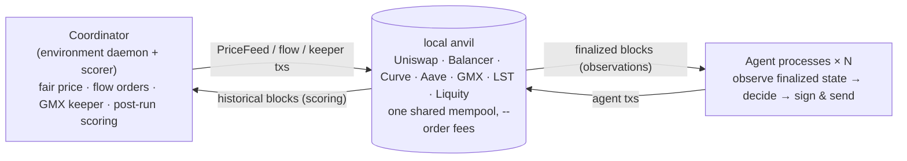

<p align="center">
  
</p>

<h1 align="center">Eris: Agent Simulator</h1>

<p align="center">
  <strong>The Agentic Financial Simulation Layer</strong><br>
  <em>Let your contracts face the swarm.</em>
</p>

<p align="center">
  <a href="https://erisnet.xyz/">erisnet.xyz</a> &nbsp;·&nbsp;
  <a href="#quick-start">Quick Start</a> &nbsp;·&nbsp;
  <a href="#documentation">Documentation</a>
</p>

<p align="center">
  
  
  
  
</p>

> **Markets ship behavior.** The real weaknesses of a protocol cannot be fully found just by scanning the checklist of an audit report. Only when many autonomous agents (trading bots) actually compete in a live market do weaknesses such as AMM price distortion, liquidation cascades, and oracle update lag surface as "real-world behavior." **Eris Agent Simulator** is an MVP (proof of concept) that reproduces this competition locally. It is the local edition of the *Agentic Financial Simulation Layer* championed by [erisnet.xyz](https://erisnet.xyz/) — an environment where autonomous agents continuously stress-test financial protocols.

A strategy simulator that runs on a multi-protocol DeFi environment with every protocol deployed on a local anvil. Multiple autonomous agents compete against each other in the same mempool, a coordinator drives the market, and after the run the value series is reconstructed and scored. Agents are never given RPC, private keys, pending transactions, or the txpool — only **observations of finalized state**.



---

## What is this

- **Multi-protocol DeFi environment** — Uniswap V3 / Balancer v2 / Curve / Aave v3 / GMX v2, plus a liquid-staking venue (a wstETH-style vault and its LST/WETH market) and a CDP stablecoin venue (an unmodified Liquity V1 fork issuing eUSD, with Stability Pool, redemptions and Recovery Mode), are all provisioned on a single Anvil and enabled pluggably through the protocol adapter registry (`sdk/src/protocols/`).
- **Multi-agent competition** — agents run as fully independent processes, subscribe to blocks at their own pace, and sign and send directly themselves. In-block ordering is determined by anvil `--order fees` (descending priority fee).
- **Controllable fair price** — the coordinator generates a SEED-derived deterministic fair price every block and writes it to the on-chain `PriceFeed` and mock oracles. Aave health factors and GMX mark prices follow it.
- **Market stress & liquidation** — nine kinds of seed-placed shock share one config section: price spikes/crashes that trigger the Aave liquidation path, whale orders, order books thinning for the length of a window, stablecoins pushed off par, a staking slash, and drift or flow episodes that change the price walk itself.
- **Self-improving agents** — the strategy trades every block on its own, and an LLM periodically rewrites it in-run from its own track record. The LLM is never in the trade path.
- **Fork-free local deploy mode** — avoids cold-state RPC round trips to the fork backend (fork RPC latency), and multi-asset (WETH/WBTC) works too.
- **Backtesting** — with a distributed state dump plus official regimes (market scenarios), a strategy can be verified over and over under the same environment and the same scoring (`--repeat` to read the distribution).

For details on the architecture (separation of the environment and agent execution), see [Architecture](docs/guide/architecture.md).

---

## Quick Start

Instead of forking Arbitrum, connect to a local anvil where the bundled [`deployer/`](deployer/) has deployed every protocol. This avoids fork RPC latency, and multi-asset (WETH/WBTC) works too. For details, see [Local Realtime Simulation](docs/guide/local-deploy.md).

### Setup

```bash
# poc (repository root)
npm install
cp config/example.yaml config/local.yaml   # run config + agent roster
cp .env.example .env.local                  # secrets (Anvil dev keys work locally; LLM backend choice next)
npm run build:contracts                     # forge build PriceFeed + mock oracles (once, if out/ is missing)

# bundled deployer/ (first time only; takes a few minutes to fetch the GMX clone + install Aave deps)
cd deployer
npm install
forge build                  # compile shared mock tokens
cp .env.example .env
./scripts/setup-vendors.sh   # clone+patch external repos (GMX), install Aave deps
cd ..
```

### Choose an LLM backend

**The default roster is self-improving**: the trading agents are rule strategies that trade every block on their own, and an LLM periodically rewrites them ([Self-improving agents](docs/guide/llm-agents.md)). A backend is therefore optional — without one the run completes normally, the revisions are recorded as failed, and the strategies keep trading unchanged. Pick one to see the improvement loop actually work:

| backend | setup |
|---|---|
| **Ollama Cloud** (default; model `gpt-oss:120b`) | put `OLLAMA_API_KEY=...` in `.env.local` |
| **Local ollama** (no key) | `ERIS_OLLAMA_BASE_URL=http://127.0.0.1:11434/api` in `.env.local`, and set a locally-pulled model via the roster env `ERIS_LLM_MODEL` |
| **Claude Code / Codex subscription** (no API key; spawns the logged-in CLI) | in `config/local.yaml`, add `ERIS_LLM_MODEL: "claude-cli:haiku"` (or `"codex"`) to the agent's `env:` |

To skip LLMs entirely and run the same strategies rule-based (`agent.ts`), remove the `env:` line from each agent in the roster. Details: [LLM Agents](docs/guide/llm-agents.md).

### Run

```bash
# Separate terminal: start anvil + deploy all venues via deployer (do not pass --exit)
cd deployer && npm run deploy -- --keep-fresh

# poc side (repository root): import the deploy addresses and run
npm run gen:local-constants
npm run sim:realtime
# The roster and every run knob come from config/local.yaml (edit the YAML to swap them out;
# backtest supports swapping the roster via --agents <roster.yaml>). One-off overrides are CLI
# flags: npm run sim:realtime -- --seed 2 --blocks 40
```

> `config/example.yaml` ships with `run.localDeploy: true`, so no flag is needed. The CLI entry point detects it at startup, sets `ERIS_LOCAL_DEPLOY=1` internally, and `sdk/src/constants.ts` overlays the locally-deployed addresses (WETH/USDC/WBTC, etc.) — no need to pass the env by hand. `--local-deploy` still works as a one-off override for a config that does not set it.

> To run against an Arbitrum fork instead, set `run.localDeploy: false` in `config/local.yaml`, remove `lst` from `run.protocols` (its vault is deployed by us and has no Arbitrum counterpart), put `ARB_RPC_URL` in `.env.local`, and start `npm run anvil` in another terminal.

> The template's 100-block / 300s length is sized so at least one revision opportunity lands (`prompt.md` declares `reviseEveryBlocks: 60`), not by LLM latency — the strategies trade every block whether or not a backend is configured. A rule-only smoke test is fine at 24 blocks / 70s. If a trading agent emits nothing but `noop`, read its `runs/<run_id>/agents/<id>.jsonl`: the `reason` on each round says why, and a revision that never ran is logged there too.

Output is written under `runs/<run_id>/` (`summary.json` / `events.jsonl` / `blocks.csv` / `market.json` / `agents/<id>.jsonl`). What to check:

- Setup completes for all agents and the flow wallet.
- Flow transactions and valid agent transactions are submitted in each block.
- `valueSeries.failedReads` in `summary.json` is `0`.

### Dashboard (optional)

An optional web UI lives in the [`dashboard/`](dashboard/) workspace (Vite + React). It is not needed to run or score anything:

```bash
npm run dashboard   # dev server at http://localhost:5173
```

It renders runs from `runs/<id>/` (`summary.json` / `events.jsonl` / `blocks.csv` / `agents/*.jsonl` / `market.json`) — pick the run in the sidebar, newest first. A run still in progress shows up as `● (live)` and can be watched as it happens (prices, blocks, event tape, and decision logs updating; scores and per-venue series appear the moment the run completes). The `market.json` artifact is derived after each run by the same historical-read reconstruction that scores it (per-venue prices, pool depth, GMX/Aave state, decoded tx notionals; zero cost to the live loop, and never an input to scoring). When the local Blockscout explorer is up (`npm run explorer`, http://localhost:3100), tx hashes, blocks, and addresses deep-link into it and its indexed height is shown next to the RPC height; without it the links simply disappear. Details, including the explorer's reset-per-chain-reset lifecycle: [Dashboard and Explorer](docs/guide/dashboard.md).

### Backtesting (iterative strategy verification)

Once you bake a state dump from a deployed anvil, you can **replay official regimes (market scenarios) as many times as you like** without launching the deployer. Market conditions are identical every time by seed determinism, and scoring is identical to realtime:

```bash
npm run gen:state-dump                                # bake once from the running deployer anvil
npm run backtest -- --regime calm --seed 101         # one scenario (regime + seed)
npm run backtest -- --scenarios config/scenarios/public.yaml   # the whole public set + standings
npm run competition -- plan --hidden hidden.yaml --lottery lottery.yaml --k 40 --out plan.yaml   # the epoch order (rules §3.3)
```

For details, see [Backtesting](docs/guide/backtest.md) and [Scoring](docs/guide/scoring.md).

---

## Documentation

For the complete local test prerequisites and repeatability checks, see [Running the test suite](docs/guide/testing.md).

| Submission starter | Strategy | Revision policy |
|---|---|---|
| [`my-arb`](example/agents/my-arb) | TypeScript `agent.ts` | `prompt.md`, `executorTs` |
| [`my-arb-py`](example/agents/my-arb-py) | Python `strategy.py`, generated `eris` SDK | `prompt.md`, `executorPy` |

Both run through the same observation, validation and signing path. See [Python setup and submission](docs/guide/python-agents.md).

**Writing strategies (for participants)** — reading order:

| Document | Contents |
|---|---|
| **[Getting Started](docs/competition-start.en.md)** / **[日本語](docs/competition-start.md)** | **Start here if you are entering the competition.** The shape of an epoch, the 8 regimes and the timeline, the vocabulary the rules use versus the code, setup, the smallest submittable agent, the run-read-fix loop, how to read the dashboard, the reference agents, and how to submit |
| [Local Realtime Simulation](docs/guide/local-deploy.md) | Setup: prerequisites, steps, and troubleshooting for non-fork local deploy mode |
| [Writing Agents](docs/guide/writing-agents.md) | Agent authoring tutorial: minimal agent → reading observations → actions → logging → verification → submission |
| [Backtesting](docs/guide/backtest.md) | Replaying state dump + official regimes, iterating with `--repeat`, sparring, what is and isn't measurable |
| [Run Output and Analysis](docs/guide/run-output.md) | The output files under `runs/<id>/` and how to analyze a run afterwards |
| [Protocols and Actions](docs/guide/protocols-and-actions.md) | Reference: actions per venue, stablecoin accounting, oracle control |
| [Scoring](docs/guide/scoring.md) | What is scored and how: P per epoch off the boundary series, the deviation score T and its weighted average (rules §4.4), the matrix as a rehearsal, the world reset unit |
| [Self-improving Agents](docs/guide/llm-agents.md) | agent.ts + prompt.md (in-run strategy rewriting, sandbox, rollback, frozen control) |
| [The Practice Devnet](docs/guide/practice-devnet.md) | Connecting your own agent to a chain that never stops, and what the practice standings are (and are not) |

**How the environment works / operations**:

| Document | Contents |
|---|---|
| [Architecture](docs/guide/architecture.md) | Separation of the environment (market mechanism + scorer) from agent execution, fair price distribution, scoring reconstruction |
| [Configuration (config/local.yaml)](docs/guide/configuration.md) | The single-source YAML config, its sections, and how to write the roster |
| [Market Stress Events](docs/guide/stress-events.md) | The nine event types — price gaps, whales, thinning books, depegs, slashes, drift and flow episodes — plus Aave liquidation victims |
| [Dashboard and Explorer](docs/guide/dashboard.md) | Watching a run live and reading a finished one; the local Blockscout explorer and its lifecycle |
| [The Practice Devnet](docs/guide/practice-devnet.md) | Running a period: registering participants, handing out the manifest, the real-chain mode, hosting the dashboard |
| [Repository Layout](docs/guide/repository-layout.md) | Quick reference for the directory layout |
| [Cross-epoch learning: the rules amendment](docs/proposals/cross-epoch-learning-rules.md) | Proposal (issue #77): the §4.7.1 / §2.5 / §4.4.2 / §7 wording that carrying an agent's state between epochs needs, and the decisions behind it |
| [Specification (as-built)](docs/spec/en/) | Normative reference for what the system *is*: runtime lifecycle, data contracts, invariants, and what is still undecided ([日本語](docs/spec/)) |

**Background**: [architecture decision records](docs/adr/) (ADR 0001–0021) hold the reasoning behind
each design choice, and [the scoring metric measurements](docs/scoring-metric-measurements.md) hold
the runs the metric decision is being made on.

---

## License

MIT — see [LICENSE](LICENSE).

That is the answer to the question this repository is built around: **copy `example/agents/<id>/`,
change it, keep what you build.** A strategy written from one of the bundled agents is yours, and
nothing here asks for it back.

A few files in the tree are somebody else's work and keep their own terms — the canonical WETH9 mock
and Curve's prebuilt artifacts. [THIRD-PARTY.md](THIRD-PARTY.md) lists them, along with the
dependencies `deployer/scripts/setup-vendors.sh` fetches at setup rather than redistributing.

---

## Disclaimer

This is an **MVP / Proof of Concept** for research and experimentation, not intended for production use. The Aave / GMX oracles are mocks controlled by the coordinator, and the fair price is a synthetic path generated deterministically. Simulation results (PnL, ranking, discrimination) depend on the environment configuration, SEED, and sample count, and do not guarantee real-market performance.

<p align="center">
  <sub>Built by <a href="https://erisnet.xyz/">Nyx Foundation</a> · <em>Let your contracts face the swarm.</em></sub>
</p>

## 参考文献
- [Deepwiki eris-agent-simulator](https://github.com/NyxFoundation/eris-agent-simulator)
- [Deepwiki 概要解説](https://deepwiki.com/search/_0f750a90-72c7-4eed-be0e-72822fa533fa)