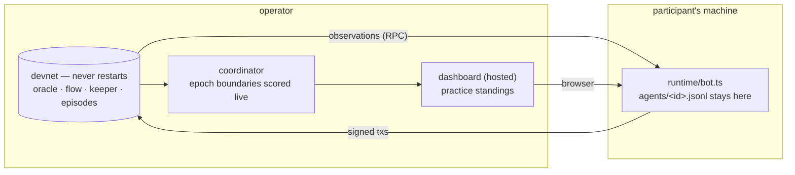

[← README](../../README.md)

# The practice devnet (ADR 0021)

A chain that does not stop, that participants connect their own agents to. It is a **practice
ground**: the competition itself is scored separately, from submitted bundles replayed over a
scenario matrix ([backtest](backtest.md), ADR 0017 / ADR 0020), and nothing that happens here feeds
into it. The standings page says so permanently, and so does the manifest.

What it is for: verifying that your agent connects, trades and survives against the real venues; and
building a feel for the market before the competition runs.



---

## For a participant

You need two things: the **environment manifest** (public, the same file for everyone) and **your own
wallet**. Nothing else is handed out, and nothing you run reports back.

### 1. Read the manifest

`manifest.json` is published by the operator and also written into every run directory. It carries
where the chain is, what is deployed on it, how long a round is, what the limits are, and which
addresses are registered.

```jsonc
{
  "status": { "scored": false, "label": "practice", "note": "…not the official scoring…" },
  "chain":  { "rpcUrl": "…", "chainId": 42069, "blockTimeSec": 2 },
  "round":  { "epochBlocks": 900, "approxSeconds": 1800 },
  "protocols": ["uniswap", "balancer", "curve", "lst", "liquity"],
  "actions": { "uniswap": ["swap", "mintLiquidity", …], … },
  "contracts": { "priceFeed": "0x…", "uniswap": {…}, … },
  "episodes": { "kinds": [{ "type": "crash", "count": 1 }, …] }
}
```

`episodes` is deliberately partial. The **kinds** of shock the period contains and **how many** are
published; **when each window opens is not** (ADR 0021 §1). Read the chain to know whether one is
open now.

There are no keys in it. That is not an oversight — the file is served over HTTP, so anything in it
is published. If the operator issued you a wallet, they hand it over separately.

### 2. Run your agent

Your agent is an ordinary Eris agent (see [writing agents](writing-agents.md)); nothing about the
strategy contract changes. What changes is that nobody spawns it, so you supply what the coordinator
used to inject:

```bash
ERIS_MANIFEST=./manifest.json \
ERIS_AGENT_ID=alice \
ERIS_AGENT_DIR=example/agents/my-strategy \
ERIS_AGENT_PRIVATE_KEY=0x… \
ERIS_RUN_DIR=./my-logs \
ASCON_KEY=… CF_ACCESS_CLIENT_ID=… CF_ACCESS_CLIENT_SECRET=… \
  node --import tsx example/agents/runtime/bot.ts
```

Or keep all of that in a gitignored file and start with one command:

```bash
cp .env.ascon.example .env.ascon   # fill in ASCON_KEY / CF_* / your key
npm run agent:ascon                # = node --env-file=.env.ascon … bot.ts (shell exports still win)
```

- **RPC headers** (`sdk/src/rpcHeaders.ts`) are attached to every request by `makeClients`:
  `ASCON_KEY` → `X-ASCON-Key` (your team's; the rate-limit unit), `CF_ACCESS_CLIENT_ID` /
  `CF_ACCESS_CLIENT_SECRET` → `CF-Access-Client-*` (shared; `CF_ID` / `CF_SECRET` also accepted).
  Missing one of the gateway's three gets you a 403. Setting only one of the CF pair is refused at
  start-up; setting none of them (local anvil) sends no headers. `ERIS_RPC_HEADERS` (a JSON object)
  adds or overrides headers for any other gateway. The `runtime_start` log line lists the header
  **names** that were applied, never the values.
- **Rate limit**: 100 req/s per key (burst 300), and EVM-executing reads (`eth_call`,
  `eth_estimateGas`, `eth_getLogs`) count as 5 each. A 429 recovers after a short wait.

- `ERIS_MANIFEST` supplies the RPC URL, the PriceFeed address, the chain id and which address table
  to use. Those last two are applied before anything else loads, because the address table is chosen
  at import time — so the command above is enough on its own, and setting `CHAIN_ID` or
  `ERIS_LOCAL_DEPLOY` in your shell overrides the manifest rather than the other way round.
  Everything else still comes from your config file (`ERIS_CONFIG`, defaulting to
  `config/local.yaml`).
- `ERIS_RUN_DIR` is **your** directory. Your decision log lands there and nowhere else — the
  dashboard cannot show it, and says so rather than rendering an empty panel.
- On the first start the runtime grants its own venue approvals, because an approval is your
  signature and the operator does not hold your key. It skips the ones already in place, so a
  restart costs nothing.

### 3. Watch

The hosted dashboard shows everything the chain says about you: your transactions (named by
decoding their calldata, not by anything you report), your positions, your per-round returns and
your standing. What it cannot show is what you *sent and lost* — a transaction that never landed
leaves no trace anyone but you can verify.

---

## For the operator

### Running a period

```bash
# 1. a chain, and a treasury account genesis prefunded on it
#    .env.local:  ANVIL_RPC_URL=… CHAIN_ID=… TREASURY_PRIVATE_KEY=0x…

# 2. before anything else, confirm the two assumptions the design rests on
npm run check:ordering -- --live --rounds 5      # issue #35: does the builder order by fee?
npm run stress:rpc -- --agents 30 --seconds 60 --write   # issue #36: does the read load fit?

# 3. the period — in the foreground while you watch it start
npm run sim:realtime -- --config config/practice.yaml

# 4. hand out credentials, one participant at a time
npm run manifest -- --config config/practice.yaml
npm run manifest -- --config config/practice.yaml --participant alice

# 5. serve the dashboard
npm run dashboard:build && npm run dashboard:serve     # :5174
```

A period runs for a week, so step 3 does not stay in a terminal. On the box that hosts it, run the
coordinator under systemd instead — `infra/devnet/` has the unit, what it needs, why a restart
begins a new competition, and the Slack alert that fires when the chain stops moving.

```bash
systemctl --user enable --now ascon-devnet.service
```

### The chain's own keys (issue #74)

A chain participants can send transactions to must not run on anvil's public test mnemonic. The
gateway allows `eth_sendRawTransaction`, so with the default words every prefunded account —
including the deployer, which holds Aave's `POOL_ADMIN`, GMX's `CONFIG_KEEPER`, the LST vault's
owner and every seeded LP position — belongs to whoever reads anvil's banner. Draining the ETH is
the least of it; the roles are the exposure.

The fix is a redeploy under a secret mnemonic, not an allowlist in front of the RPC: the key is
public, so any path that reaches the chain reaches it.

```bash
# on the box that owns the chain, with the mnemonic never written into the repository
cd deployer
MNEMONIC="$(cat ~/.ascon-secret-mnemonic)" npm run deploy -- --keep-fresh
cd ..
npm run gen:local-constants          # every address is CREATE(deployer, nonce), so all of them moved
npm run gen:state-dump               # the dump the chain is restarted from

# .env.local, for the stress events that trade as the environment
#   DEPLOYER_PRIVATE_KEY=0x…         (index 0 of that mnemonic)
```

Restart the chain from the new dump **with the same mnemonic** — `--load-state` restores the
contracts, but the dev accounts still come from the mnemonic anvil was started with, and the
addresses in the dump are the ones the secret deployer created:

```bash
anvil --port 8545 --code-size-limit 50000 --base-fee 0 --gas-limit 320000000 \
  --accounts 10 --balance 1000000 --mnemonic "$(cat ~/.ascon-secret-mnemonic)" \
  --load-state backtest/state/venues-state.json
```

A dump baked before the rotation is a default-mnemonic chain in a file: reloading it puts the
public deployer back in charge of every venue, whatever mnemonic the node was started with.
Rotate the two together.

### Registering a participant

A roster entry is a registration, not a launch instruction:

```yaml
agents:
  - id: noop
    wallet: AUTO                 # the operator's own baseline (ADR 0019 §2). AUTO, not a named dev
    baseline: true               # key: on a real chain those come prefunded, and the endowment is a
                                 # floor rather than an assignment — see below.

  - id: alice
    external: true
    address: "0x…"               # they hold the key. Prefer this.

  - id: bob
    external: true
    wallet: AUTO                 # the operator issues a funded key and hands it over
    participant: team-b          # rules §2.2: the unit this agent is one submission of (optional)
```

`command` / `args` / `dir` / `env` on an external entry are **refused**, not ignored: a roster that
silently kept them would read as if the operator were running the agent.

`participant` names the **participant unit** of rules §2.2 — a person or a team that may enter two
agents and is scored on the higher. Two entries with the same value are that unit's two submissions.
It travels with the agent into `agents_registered`, the manifest, `summary.json` and `matrix.json`;
the standings still rank agents, and collapsing a unit to its better one is the reader's step.

### Registering during the period

The roster is read once, at startup. A period runs for weeks and participants register throughout,
and restarting the coordinator to add one opens a **new competition directory** — the standings
split in two. So the config can name a second list that is re-read while the chain runs:

```yaml
run:
  registrationsFile: config/registrations.yaml      # see config/registrations.example.yaml
```

```yaml
# config/registrations.yaml — a list of external registrations, YAML or JSON
- id: carol
  address: "0x…"
  participant: team-c          # optional
  description: joined day 12   # optional
```

The file is polled every ~30 blocks (a minute at the practice cadence). Each new entry goes through
exactly what the setup path does for an `external: true` + `address` roster entry: a runtime without
a key, attribution by address, the same endowment (cheatcode on anvil, treasury transfer on a real
chain), live scoring from the **next** round boundary, and the roster republished
(`agents_registered` again, `manifest.json` rewritten, plus `agent_external_registered`).

- Entries already in the roster are a no-op. A duplicate id or address is ignored with a
  `registration_ignored` event that says why — an address is one agent, and a registration is not
  how an agent moves to a new key.
- A malformed file is reported once per edit (`registrations_reload_failed`) and never stops the run;
  fix the file and the next poll picks it up. A path that does not exist yet is said once
  (`registrations_file_missing`) and polled until it does.
- An agent registered mid-day has **no P for that day**: there is no round it was measured at the
  start of, and the series does not invent one. It is scored from the next day's segment. Its
  transactions are recorded from the block it was registered.

### Transactions from addresses nobody registered

On this chain those are participants too — whoever sends before their registration is read, or
without registering. Their transactions used to be dropped from `blocks.csv` as "outside the run",
which made them invisible in the one artifact that could show them. They are now recorded with the
sender address as the owner and the role `external`: `method` still comes from the calldata, nothing
scores or rule-checks them, and the row answers "did my transaction land?" for a participant who has
not yet appeared in the roster.

### Switching between a local node and the devnet

A run's target has two axes, set in different places, and both have to move together:

| axis | where | local dev node | devnet |
|---|---|---|---|
| the chain | `.env.local` | `ANVIL_RPC_URL=http://127.0.0.1:8545` | the devnet's RPC, `CHAIN_ID`, `TREASURY_PRIVATE_KEY` |
| the mode | `run.chainMode` / `--chain-mode` | `anvil` (default) | `external` |
| the addresses | `sdk/src/constants.local.ts` | generated from the local `deployments.json` | generated from the devnet's |

The config file itself does not change:

```bash
# local
npm run sim:realtime -- --config config/practice.yaml

# the devnet — same file, one flag, plus the addresses for that deployment
DEPLOYMENTS_JSON=<devnet>/deployments.json npm run gen:local-constants
npm run sim:realtime -- --config config/practice.yaml --chain-mode external
```

There is one generated address overlay at a time, so moving between two deployments means
regenerating it. Forgetting to is the easy mistake, and it used to surface minutes into setup as
`Cannot decode zero data ("0x")` against a bare address — which is what a call to an address holding
no code looks like, and says nothing about what went wrong. Every run now checks the deployment
before it does anything else and names what is missing and how to fix it.

### On a real chain

`run.chainMode: external` turns every anvil cheatcode into a refusal that names the mechanism
replacing it (issue #33). Funding becomes real transfers from the treasury; blocks come from the
sequencer; nothing resets. It also refuses a few combinations up front, because each of them is a
run that would look healthy and mean nothing:

| refused | why |
|---|---|
| no `TREASURY_PRIVATE_KEY` | every balance has to be *sent* from somewhere |
| `localDeploy: false` | the external chain runs our own venue deployment, and the address overlay is what names it |
| `economicGas: true` | that profile finalizes prices with a storage write, which no real chain permits |
| `stressVictimCount > 0` | victims need a fresh state per run, and this chain has none |
| a permissionlessly mintable token | free money for whoever notices, and no score computed against it means anything |

That last one needs the minter-gated `MockERC20`, so a deployment (and any state dump built from it)
has to be rebuilt before external mode will start against it.

**The endowment is a floor, not an equalizer.** A cheatcode *assigns* a balance; a treasury *adds* to
one. So an address that already holds something keeps it — right for a chain that never resets, and a
trap at the start of a period: the first external run had two agents on prefunded dev accounts start
with $3.0bn against a fresh address's $34k, and their per-round returns were a report on one large
ETH holding. Every run records `initial_endowment` and warns above a 2x spread; use fresh addresses
for a fresh field. It is a warning rather than a refusal because mid-period a spread is real history.

**Setup is minutes, not instants.** Every transaction waits for the sequencer, so funding N wallets
is N × (a few blocks) before the first agent trades. The treasury's transfers and each wallet's
approvals go out as batches — one sender, consecutive nonces, one wait — and the loop prints its
progress, because an environment that is silent for ten minutes reads as one that has hung.

### Length

A period is bounded in **blocks**, not wall-clock seconds. An episode's window is placed as a
fraction of the run's length (ADR 0009), so a run with no block count has nowhere to put one and
fails at startup — `blocks: 0` with a week-long time limit is the shape a never-ending chain
suggests and the one that does not start. `config/practice.yaml` states a week at a two-second
cadence (302,400 blocks) and keeps `seconds` as a generous ceiling rather than the stop condition.

### Segments are an operator's word

A segment is where files are written, and participants never see the term. In the dashboard a
period's segments appear by date (`2026-09-02`), the competition by its name, and the standings by
agent — the word "segment" is in the config, the console and the directory names, and nowhere on
screen. The manifest handed to participants does not contain it at all.

That is the same discipline the rest of the UI follows (internal ids stay out of it), and it has one
consequence worth stating: **segments are also the unit the standings average over**. Each scenario
is one epoch of the deviation score (rules §4.4), so daily segments mean one epoch per day whatever
each day's round count. Cutting the period differently changes that weighting — it does not change a
single round's return, which is placed on a fixed grid from the run's first block and is entirely
independent of where the cuts fall.

### How many rounds a period has

A round is a fixed length, so the count grows with the period — but the dashboard reads a **segment**,
not the period, so what it renders is bounded by the segment:

| | 30-minute rounds |
|---|---|
| per 24h segment | **48 rounds** — the steady state, whatever the period's length |
| per week, unsegmented | 336 rounds in one bar |

The artifacts follow the same split. Measured at ~1.4 KB of `events.jsonl` and ~0.7 KB of
`blocks.csv` per block on a five-venue run, one week unsegmented is a **435 MB events.jsonl and a
221 MB blocks.csv**; cut into days it is ~62 MB and ~32 MB each. That is what §6 is for, and a run
longer than about eleven hours with `segmentHours: 0` says so at startup rather than finding out
later.

Nothing grows without bound while segmenting. Every artifact is per segment (`events.jsonl`,
`blocks.csv`, `epochs.jsonl`, `market.jsonl` all restart), and the only thing the coordinator holds
across the whole period is the epoch series — one number per agent per round, which is 336 × N for a
week.

### What a period produces

One directory per day (`run.segmentHours`), under one competition:

```
runs/<period>/
  matrix.json           the index — one entry per day
  2026-09-01-s00/       summary.json · events.jsonl · blocks.csv · epochs.jsonl · market.jsonl · manifest.json
  2026-09-02-s01/
  …
```

Each segment is an ordinary run directory that every existing tool reads. The chain is continuous
across them, and the epochs partition exactly: a segment carries the previous boundary when it
starts mid-epoch, and does not when it starts on one — so no round is lost at a seam and none is
counted twice.

Every segment opens with the same header the first one did — `run_started_realtime`,
`agents_registered`, `manifest.json` and, when the period has episodes, the `stress_schedule` — so
a viewer landing on Thursday does not have to read Monday. The schedule is written complete,
resolved windows included, because the on-disk record is what the period is audited from (rules
§7.2); keeping future windows from the public is the hosted dashboard's job, not the writer's.

Scores come from cross-sections taken **at** each epoch boundary rather than swept up afterwards
(ADR 0021 §3), which is what makes standings exist during the period at all — and what removes the
dependency on a node's history depth. A run short enough to have both checks the two against each
other and reports the worst disagreement (`epoch_series_agreement`).

---

## What is deliberately missing

- **Your decision log, on the operator's side.** It is on your machine. The panels that would show
  it say that instead of rendering empty.
- **Submitted-but-not-included transactions.** They were never verifiable for an agent the operator
  does not run; included transactions are on the chain and are counted there.
- **`alphaUsdc` per segment.** Alpha needs the fixed-reference sweep over a whole run, and a segment
  of a continuous chain is not one. Net PnL and the round scores are per segment.

## See also

- [ADR 0021](../adr/0021-continuous-practice-devnet-with-self-hosted-agents.md) — the decisions and
  what they cost
- [backtest](backtest.md) — the official pipeline, which this does not touch
- [writing agents](writing-agents.md) — the strategy contract, unchanged
